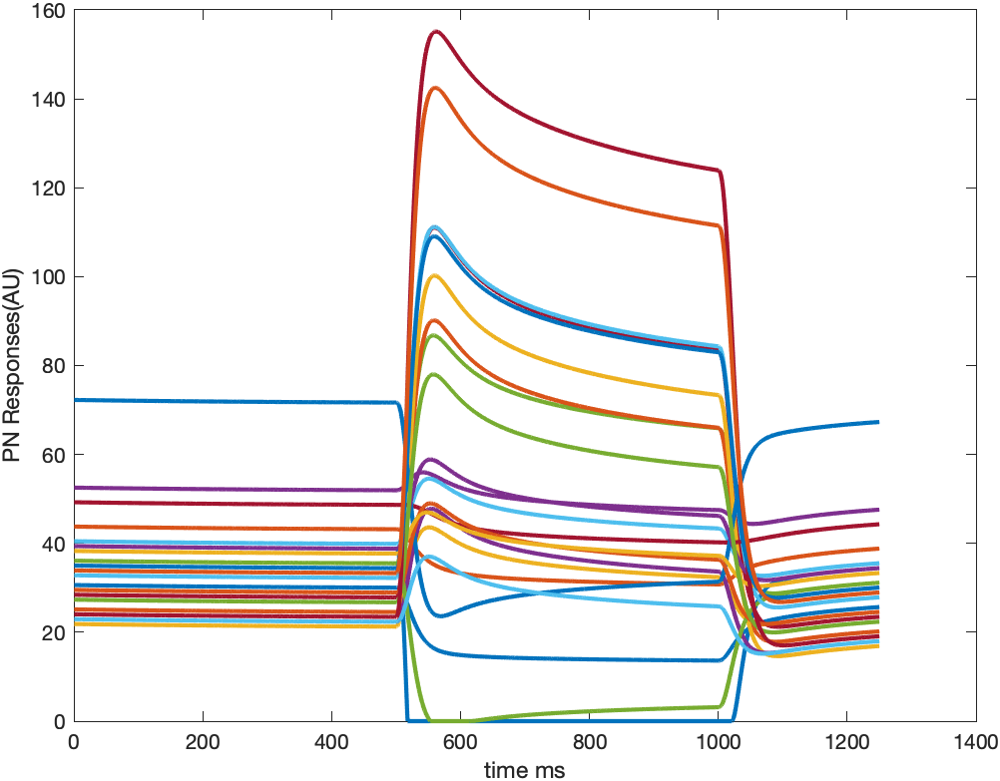
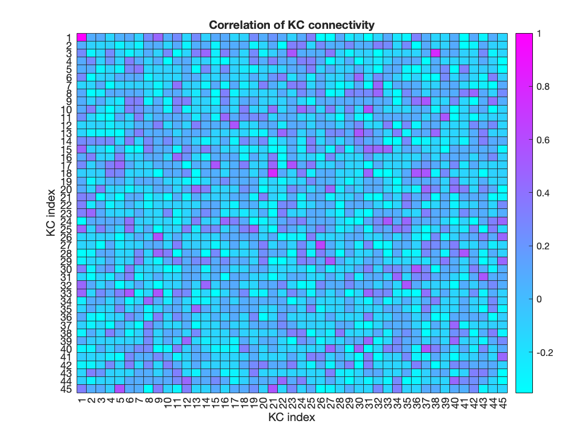
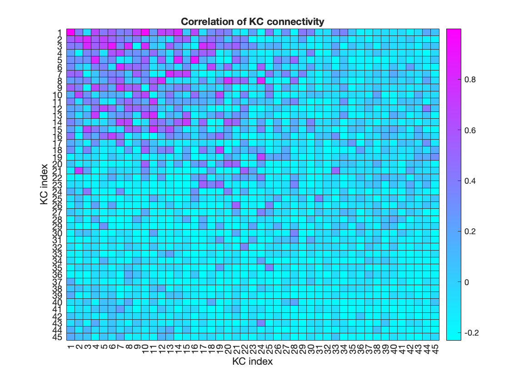
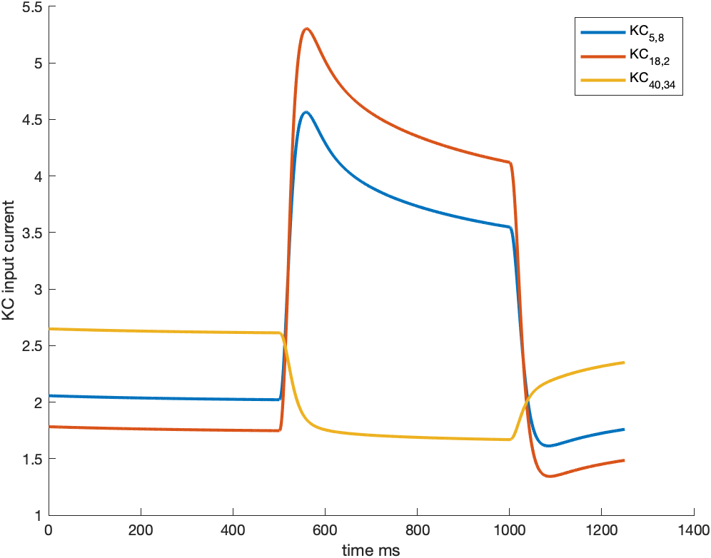

# Input from PNs to 2D KC matrix

```odor_PN_t.mat``` is 110 odor responses simulated in 23 PNs during 2500 time steps from Kennedy model. Each time step is 0.5 ms. The dimention of this matrix is 110\*23\*2500.

Here is the plot of 23 PN odor responses to odor \#1:


The y-axis can be considered firing frequency or the amount of released neural transmitters to connected KCs.

```PN_KC_connect.m``` is a helper function to connect PN to KC either randomly or following a spatial distribution. 

Specify this function using ```w_matrix = PN_KC_connect(23,[45,45],6,"full random",1,false);``` can build a completely random connection, each KC randomly choose 6 from 23 PNs. Here is the heatmap of connectivity correlation to $KC_{1,1}$:


Using  ```w_matrix = PN_KC_connect(23,[45,45],6,"local random",1,false);``` can make KCs close to each other have a higher chance to share connectivty:


```load_KC_input.m``` is a demo code to load PN responses and provide input to a 45\*45 2D KC matrix. 

Here is a demo of input current to three KCs. Adjust A can change the amplitude of current:
